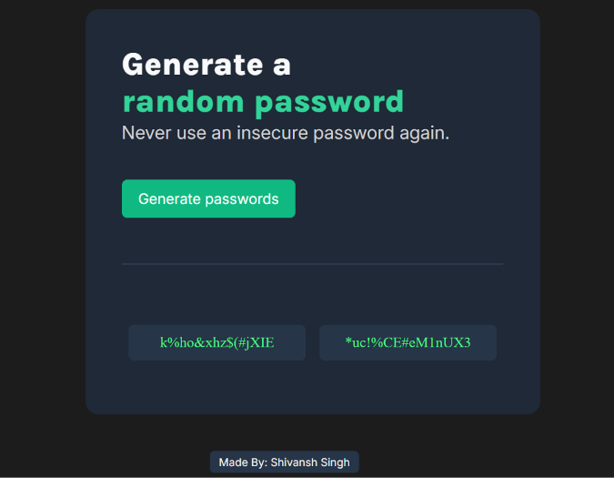

# 🔐 Password Generator

A simple **Random Password Generator** built using **HTML, CSS, and JavaScript**.

It generates two random passwords containing uppercase letters, lowercase letters, numbers, and special characters.

## 🚀 Live Demo

[Password Generator](https://passwordgenerator204.netlify.app/)

## ✨ Features

* Generate two random passwords
* 15-character passwords
* Includes uppercase letters, lowercase letters, numbers, and special characters
* Simple and clean UI

## 🛠️ Technologies Used

* HTML5
* CSS3
* JavaScript
* Google Fonts

## 📸 Screenshot

## 📖 How It Works

Click the **"Generate passwords"** button and two random 15-character passwords will be generated.

## 👨‍💻 Author

**Shivansh Singh**

Made with HTML, CSS & JavaScript.
